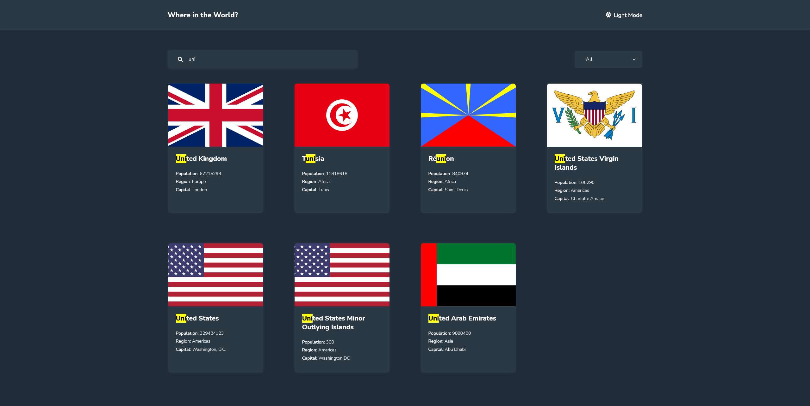
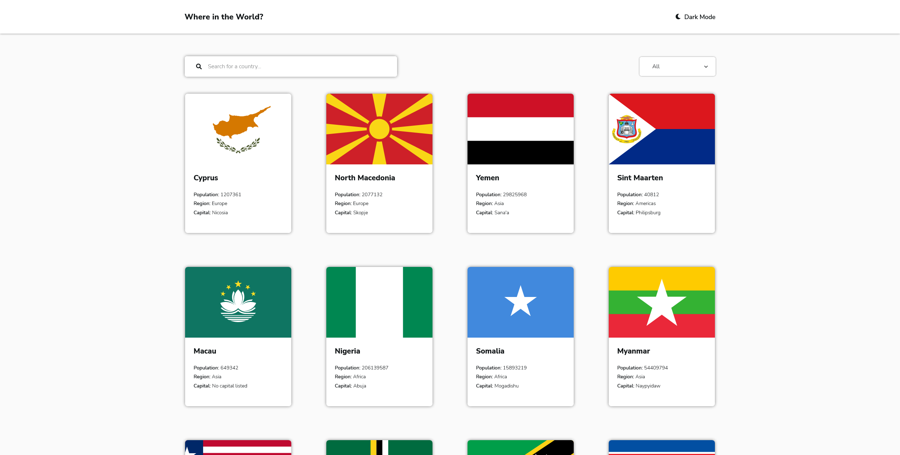
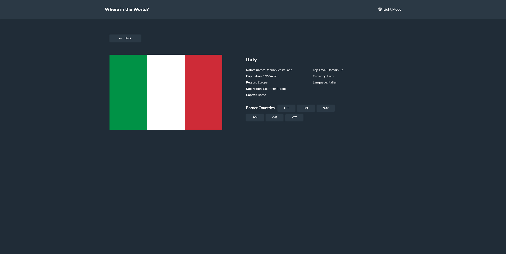
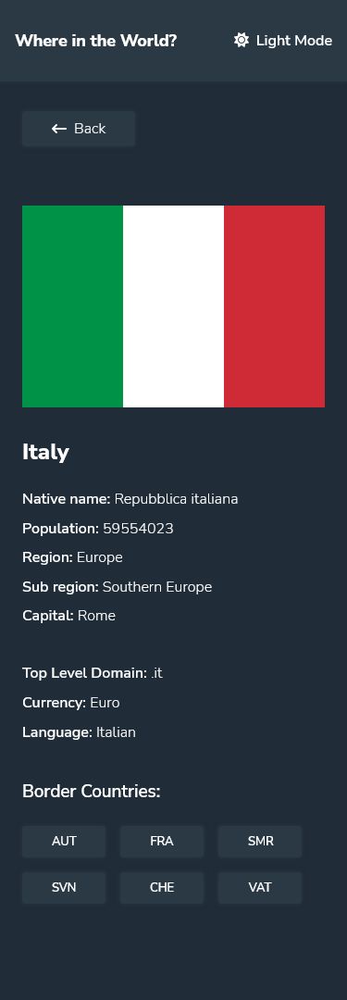
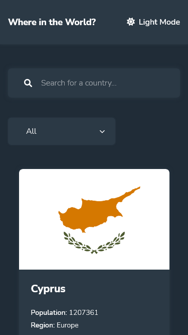
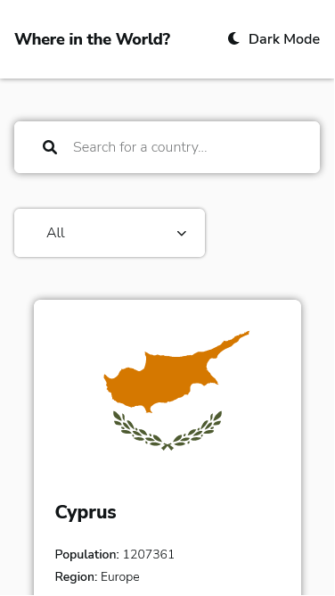

# Frontend Mentor - REST Countries API with color theme switcher solution

This is a solution to the [REST Countries API with color theme switcher challenge on Frontend Mentor](https://www.frontendmentor.io/challenges/rest-countries-api-with-color-theme-switcher-5cacc469fec04111f7b848ca). Frontend Mentor challenges help you improve your coding skills by building realistic projects.

## Table of contents

- [Overview](#overview)
  - [The challenge](#the-challenge)
  - [Screenshot](#screenshot)
  - [Links](#links)
- [My process](#my-process)
  - [Built with](#built-with)
  - [What I learned](#what-i-learned)
  - [Continued development](#continued-development)
  - [Useful resources](#useful-resources)
- [Author](#author)

## Overview

### The challenge

Users should be able to:

- See all countries from the API on the homepage
- Search for a country using an `input` field
- Filter countries by region
- Click on a country to see more detailed information on a separate page
- Click through to the border countries on the detail page
- Toggle the color scheme between light and dark mode _(optional)_

### Screenshot








### Links

- Solution URL: [GitHub](https://callme-al.github.io/fementor-rest-countries/#/)
- Live Site URL: [GitHub Repo](https://github.com/CallMe-AL/fementor-rest-countries)

## My process

### Built with

- Semantic HTML5 markup
- CSS custom properties
- Flexbox
- CSS Grid
- Mobile-first workflow
- Lazy Loading
- [React](https://reactjs.org/) - JS library
- [React Router](https://reactrouter.com/) - Router for React

### What I learned

I've used React Router before, but this is the first time building something using dynamic routes! I played around with grid some more, and gained much more experience filtering data by either selection or searching. I also learned about the Object.keys() method, which was instrumental in dynamically listing data for which I was unsure what the property name would be ahead of time in an object.

I especially learned how to highlight search terms, without using innerHtml (which is strongly discouraged by React for XSS reasons), using the following code ([see my inspiration from Stack Overflow](https://stackoverflow.com/questions/39171718/highlight-matched-letters-words-in-a-search-list-using-reactjs)):

```js
let regex = new RegExp(searchVal, "gi");
let match = name.match(regex);

if (match != null) {
  let parts = name.split(match[0], 2);

  return (
    <div>
      {parts[0]}
      <mark>{match[0]}</mark>
      {parts[1]}
    </div>
  );
} else {
  return name;
}
```

### Continued development

Using RegEx to search for data was really cool! I'd love to gain more knowledge and experience with it. Additionally, I'd like to play more with React Router. Css-wise, I'd like to learn more about the relatively-recent aspect-ratio variable and how to more properly implement it.

### Useful resources

- [React Router Docs](https://reactrouter.com/docs/en/v6/getting-started/tutorial) - Getting started and more with React Router.
- [Object.keys()](https://developer.mozilla.org/en-US/docs/Web/JavaScript/Reference/Global_Objects/Object/keys) - Great doc for learning how the method works and what it returns.
- [The select tag in React](https://developer.mozilla.org/en-US/docs/Web/JavaScript/Reference/Global_Objects/Object/keys) - How React treats the select attribute differently. Very useful when I tried learning how to store filtered selections in localstorage.
- [Marking search terms](https://bitsofco.de/a-one-line-solution-to-highlighting-search-matches/) - Gave me an idea how to highlight search terms. Also where I learned of the mark element for the first time. I had to change the implementation around for React, as noted above.

## Author

- Website - [My Portfolio](https://callme-al.github.io/portfolio/)
- Frontend Mentor - [@CallMe-Al](https://www.frontendmentor.io/profile/CallMe-AL)
